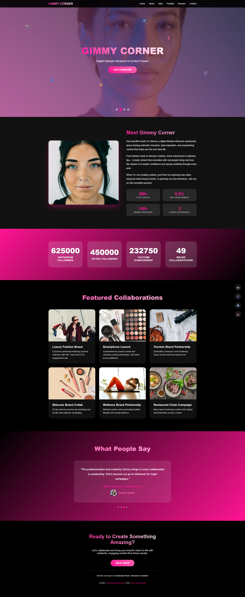

# InfluencerPro Theme Documentation

**Version:** 1.0.0  
**Author:** Amanullah Khan  
**Company:** Nexaman Creations  
**Release Date:** June 2025  
**License:** Premium Theme

---



## 🎯 Overview

InfluencerPro is a modern, sleek one-page personal branding website theme designed specifically for social media influencers, content creators, and digital personalities. The theme features bold typography, interactive animations, and a vibrant color scheme that captures the energy and aesthetic of contemporary social media culture.

## 🎨 Design Philosophy

The theme is built around the concept of **"Digital Energy"** - combining bold visual elements with smooth, engaging interactions to create a memorable brand presence. The design emphasizes:

- **Bold Typography:** Large, gradient-filled headings that command attention
- **Energetic Color Palette:** Hot pink (#ff1493), pure black (#000), and crisp white (#fff)
- **Interactive Elements:** Floating animations, hover effects, and smooth transitions
- **Mobile-First Approach:** Responsive design optimized for all devices

## 🚀 Key Features

### Core Functionality
- **Responsive Design:** Fully responsive across all devices (320px to 4K)
- **Sticky Navigation:** Fixed header with smooth scroll navigation
- **Mobile Menu:** Hamburger menu with overlay for mobile devices
- **Hero Video Background:** Autoplay video background support
- **Animated Counters:** Real-time counting animations for follower statistics
- **Portfolio Grid:** Showcase collaborations and projects
- **Testimonial Carousel:** Auto-rotating testimonials from brands and fans
- **Parallax Effects:** Smooth parallax scrolling on hero section
- **Floating Social Icons:** Animated social media buttons

### Performance Features
- **CSS Animations:** Hardware-accelerated animations for 60fps performance
- **Optimized Loading:** Efficient code structure for fast page loads
- **SEO Ready:** Semantic HTML structure for search engine optimization
- **Cross-Browser Compatible:** Works on all modern browsers

## 📱 Responsive Breakpoints

| Device Type | Screen Width | Layout |
|-------------|--------------|---------|
| Desktop | 1024px+ | Full desktop experience |
| Tablet | 768px - 1024px | 2-column layouts |
| Mobile | 480px - 768px | Single column, mobile menu |
| Small Mobile | 320px - 480px | Compact layout |
| Extra Small | <320px | Minimal spacing |

## 🎨 Color Scheme

### Primary Colors
- **Hot Pink:** `#ff1493` - Main brand color for CTAs and highlights
- **Pink Gradient:** `#ff69b4` - Secondary gradient color
- **Pure Black:** `#000000` - Background and text color
- **Pure White:** `#ffffff` - Text and contrast elements

### Gradient Combinations
- **Primary Gradient:** `linear-gradient(45deg, #ff1493, #fff)`
- **Background Gradient:** `linear-gradient(135deg, #ff1493, #000)`
- **Button Gradient:** `linear-gradient(45deg, #ff1493, #ff69b4)`

## 📝 Content Sections

### 1. Hero Section
- **Video Background:** Lifestyle/brand showcase video
- **Main Headline:** Large, gradient text with brand name
- **Subtitle:** Brief description of influencer's niche
- **CTA Button:** Primary action button for collaborations

### 2. Statistics Section
- **Animated Counters:** Live counting animations
- **Platform Metrics:** Instagram, TikTok, YouTube followers
- **Collaboration Count:** Number of brand partnerships
- **Glass Morphism Cards:** Translucent cards with blur effects

### 3. Portfolio Section
- **Grid Layout:** Responsive grid of collaboration showcases
- **Hover Effects:** Scale and shadow animations on hover
- **Project Cards:** Each card includes image, title, and description
- **Categories:** Fashion, Tech, Travel, Beauty, Fitness, Food

### 4. Testimonials Section
- **Auto-Carousel:** Rotating testimonials every 4 seconds
- **Mixed Reviews:** Both brand testimonials and fan reviews
- **Navigation Dots:** Manual navigation controls
- **Glass Effect:** Blurred background with transparency

### 5. Contact Section
- **Clear CTA:** Collaboration invitation
- **Contact Information:** Email link for business inquiries
- **Call-to-Action:** Prominent contact button

## ⚙️ Technical Specifications

### Dependencies
- **No External Dependencies:** All CSS and JavaScript is self-contained
- **Font Loading:** System fonts for optimal performance
- **Icon System:** Unicode emoji icons for universal compatibility

### Browser Support
- **Chrome:** 70+
- **Firefox:** 65+
- **Safari:** 12+
- **Edge:** 79+
- **Mobile Browsers:** iOS Safari 12+, Chrome Mobile 70+

## 🎬 Animation System

### CSS Animations
- **slideInUp:** Main entrance animation for content
- **float:** Continuous floating animation for social icons
- **fadeIn:** Smooth fade transitions for testimonials

### JavaScript Interactions
- **Scroll Animations:** Intersection Observer for performance
- **Counter Animations:** Smooth number counting with easing
- **Parallax Effect:** Transform-based parallax on scroll
- **Mobile Menu:** Smooth slide transitions

## 📋 Customization Guide

### Changing Colors
Update these CSS custom properties in the `:root` selector:
```css
:root {
  --primary-color: #ff1493;
  --secondary-color: #ff69b4;
  --background-color: #000000;
  --text-color: #ffffff;
}
```

### Updating Content
1. **Influencer Name:** Update in hero section and navigation
2. **Statistics:** Modify `data-target` attributes in stats section
3. **Portfolio Items:** Replace project cards with actual collaborations
4. **Testimonials:** Update testimonial content and authors
5. **Contact Information:** Update email and contact details

### Adding Social Links
Update the floating social icons with actual social media URLs:
```html
<a href="https://instagram.com/username" class="social-icon">📷</a>
<a href="https://tiktok.com/@username" class="social-icon">🎵</a>
```

## 🛠️ Installation & Setup

### Basic Setup
1. Download the theme files
2. Upload to your web server
3. Update content in `index.html`
4. Replace placeholder images with actual content
5. Test on multiple devices

### Advanced Customization
1. Modify CSS variables for colors and spacing
2. Update JavaScript counters with real statistics
3. Add actual video content for hero background
4. Integrate with analytics tools
5. Optimize images for web performance

## 📊 Performance Optimization

### Best Practices
- **Image Optimization:** Use WebP format for better compression
- **Video Compression:** Optimize hero video for web delivery
- **CSS Minification:** Minify CSS for production use
- **JavaScript Optimization:** Remove unused code for faster loading
- **Caching:** Implement browser caching for static assets

### Loading Speed Tips
- Lazy load portfolio images
- Preload critical fonts
- Optimize video file size
- Use CDN for asset delivery
- Enable GZIP compression

## 🔧 Troubleshooting

### Common Issues
1. **Video Not Playing:** Ensure video file is properly encoded
2. **Animations Laggy:** Check for hardware acceleration support
3. **Mobile Menu Issues:** Verify JavaScript is properly loaded
4. **Counter Not Working:** Check Intersection Observer support

### Browser Compatibility
- For older browsers, provide fallbacks for CSS Grid
- Use vendor prefixes for animations
- Test on actual devices, not just browser dev tools

## 📞 Support & Credits

### Theme Information
- **Developed by:** Amanullah Khan
- **Company:** Nexaman Creations
- **Theme Name:** InfluencerPro
- **Version:** 1.0.0

### Contact Support
For technical support or customization services:
- **Email:** hireme@nexaman.site
- **Website:** www.nexaman.site

### License Information
This theme is licensed for commercial use. Redistribution requires permission from Nexaman Creations.

---

## 🎉 Conclusion

InfluencerPro represents the cutting edge of modern web design for social media influencers. With its bold aesthetic, smooth animations, and mobile-first approach, it provides the perfect platform for building a strong digital brand presence.

The theme combines performance with visual impact, ensuring that your personal brand stands out in the crowded digital landscape while providing an exceptional user experience across all devices.

**Ready to influence? Let's create something amazing together!**
